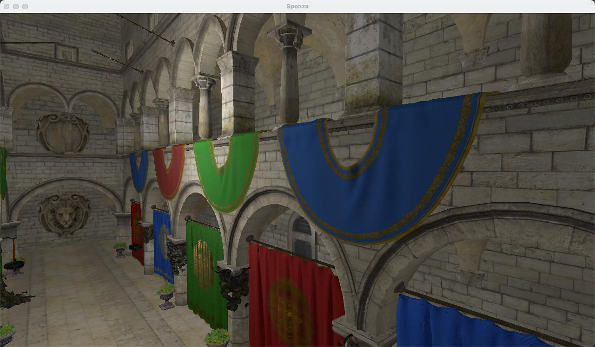
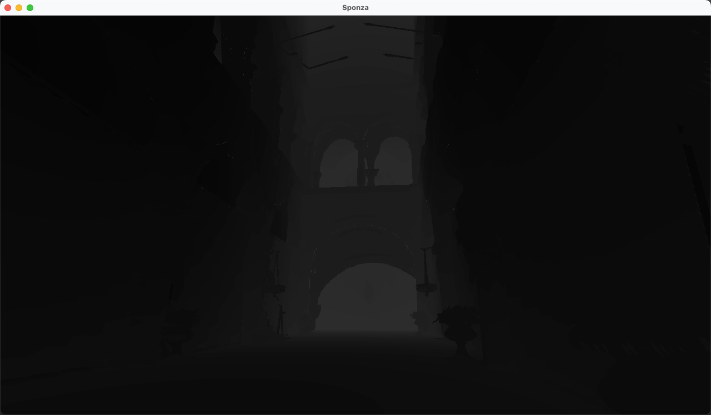
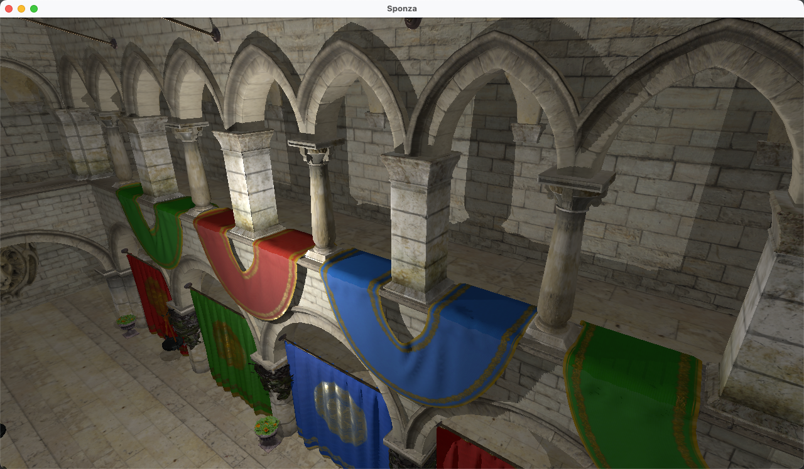
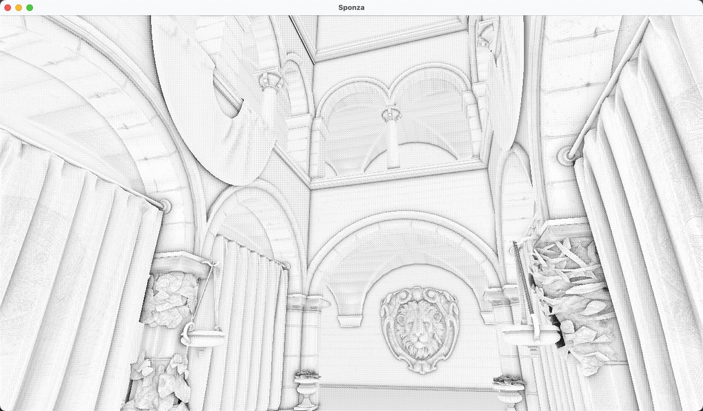

# Sponza 渲染
基于 OpenGL 的练手项目

## 依赖
* glfw3
* glm
* tiny-gltf
* glad

## 结果
#### 基于microfacet的 gltf 模型渲染, 点光源

#### omnidirectional shadow maps

#### 基本阴影

#### SSAO

## Reference: 
* [learnOpenGL](https://learnopengl-cn.github.io/)

`
